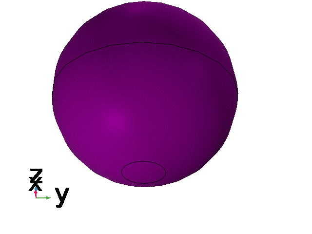
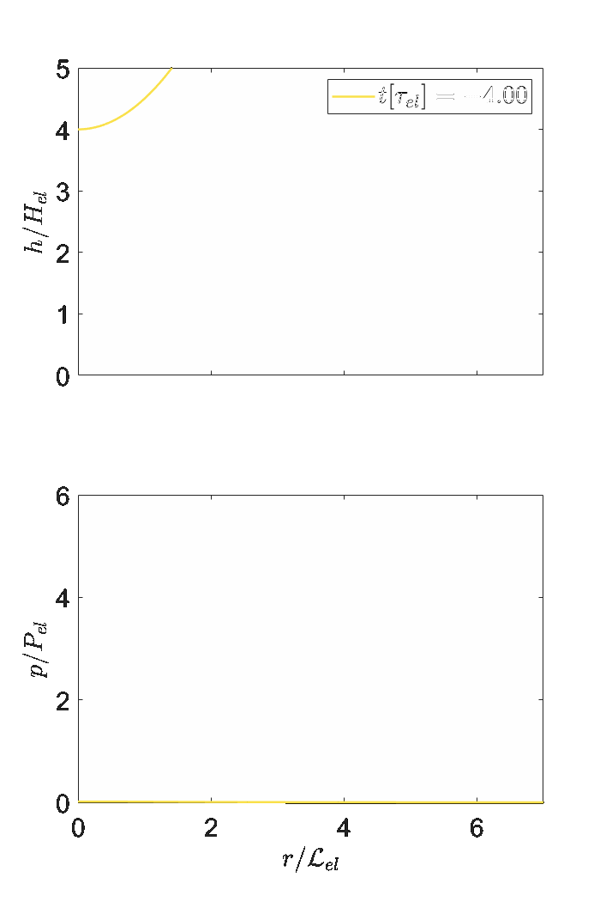
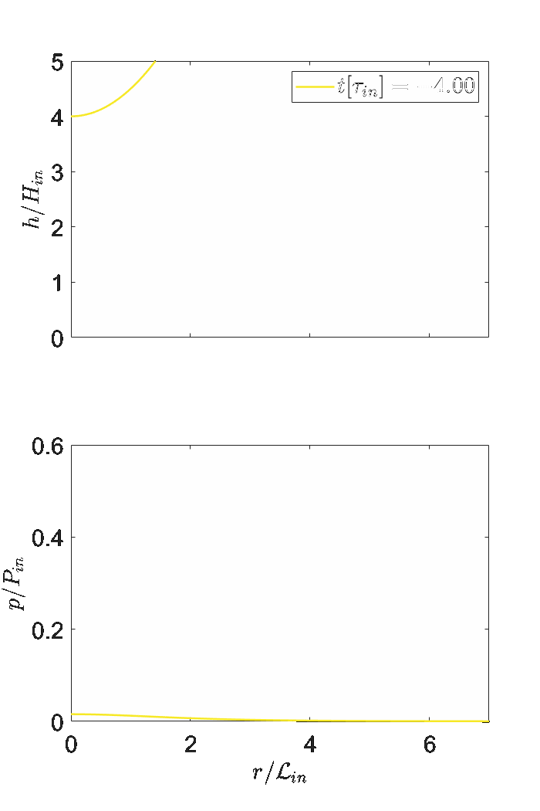
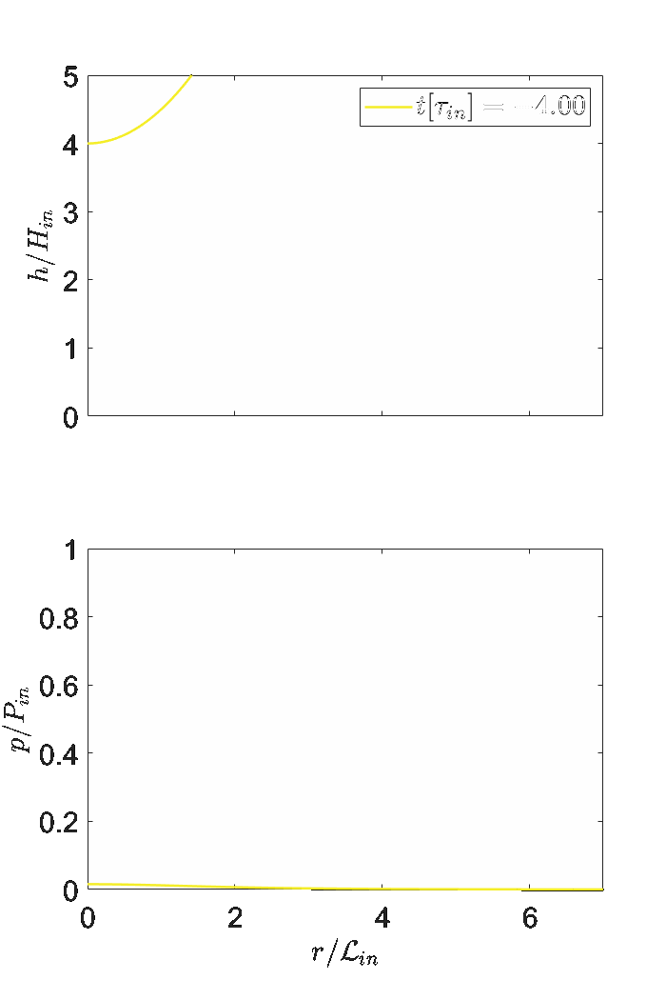

# Fluid-Mediated Impact of Soft Solids

This repository contains the code used for the simulations and scaling reported in the paper **"Fluid-Mediated Impact of Soft Solids"**. This study explores the interaction of soft solids with fluid media under impact, employing numerical simulations to capture the key dynamics. 

## Overview

In this repository, you will find:

- **MATLAB Codes**: To link MATLAB with COMSOL, set up and run simulations.
- **Mathematica Notebooks**: To perform the scaling analysis as reported in *Appendix A* of the paper.

## MATLAB Codes

`comsol_server_link.m`: This script establishes a link between MATLAB and COMSOL. It first launches the COMSOL server and then connects MATLAB to the COMSOL Multiphysics environment.
For more details check the COMSOL documentation at https://doc.comsol.com/5.4/doc/com.comsol.help.llmatlab/LiveLinkForMATLABUsersGuide.pdf .
Once the connection is established it is possible to launch simulation by calling `simulation_comsol.m`, which sets up and runs the simulation in COMSOL. It takes input parameters such as velocity, impactor size, material properties, and simulation conditions, and then executes the simulation. It also directly extracts some data in `.txt` format for further processing.

To study the cases of the expriments from **"Zheng, S., Dillavou, S. & Kolinski, J. M. 2021, Air mediates the impact of a compliant hemisphere on a rigid smooth surface. Soft Matter 17 (14), 3813–3819"** launch directly `simulations_experiments.m`, which in turn will call `simulation_comsol.m` with the appropriate parameters.

## Mathematica Notebooks

The two notebooks automaticlly compute the characteristic scales for the diffrent regimes as well as the relative transtion parameters for solid impactors `fluid-mediated-impact-soft-solids.nb` and droplets `fluid-mediated-impact-droplets.nb`.

## Software Requirements

- COMSOL 6.0
- MATLAB 2022a or later
- Mathematica 13.3 or later

Here are a few animations that visually represent the core ideas of our study:

1. **Elastic regime**: 

  
  

    A simulation showing the impact of a soft solid at small velocities with elastic Hertzian-like response 
    (check also the amazing work of <strong>Bertin, Vincent, 2024 Similarity solutions in elastohydrodynamic bouncing, 
    <em>Journal of Fluid Mechanics (986)</em></strong>).
  

2. **Inertial regime**:

  
  

    A simulation showing the impact of a soft solid at high velocities with dynamic inviscid droplet like response (check also for example  <strong>Hicks, P. D. & Purvis, R. 2010 Air cushioning and bubble entrapment in three-dimensional droplet impacts, <em>Journal of Fluid Mechanics (649)</em></strong>).
  

3. **Transition between regimes**: !

  
  

    A simulation showing the impact of a soft solid at the transtion between the elastic and inertial regime where <em>gliding/skating</em> takes place.
  

## Contact

For any questions or feedback, please contact jacopo.bilotto@epfl.ch.
As mentioned in the paper there is still a lot of room for improvement of the numerics, as well as additional analysis to be done (FEM and physical instabilities, viscoelasticity, more complex geometries and kinetic effects, just to name a few).
